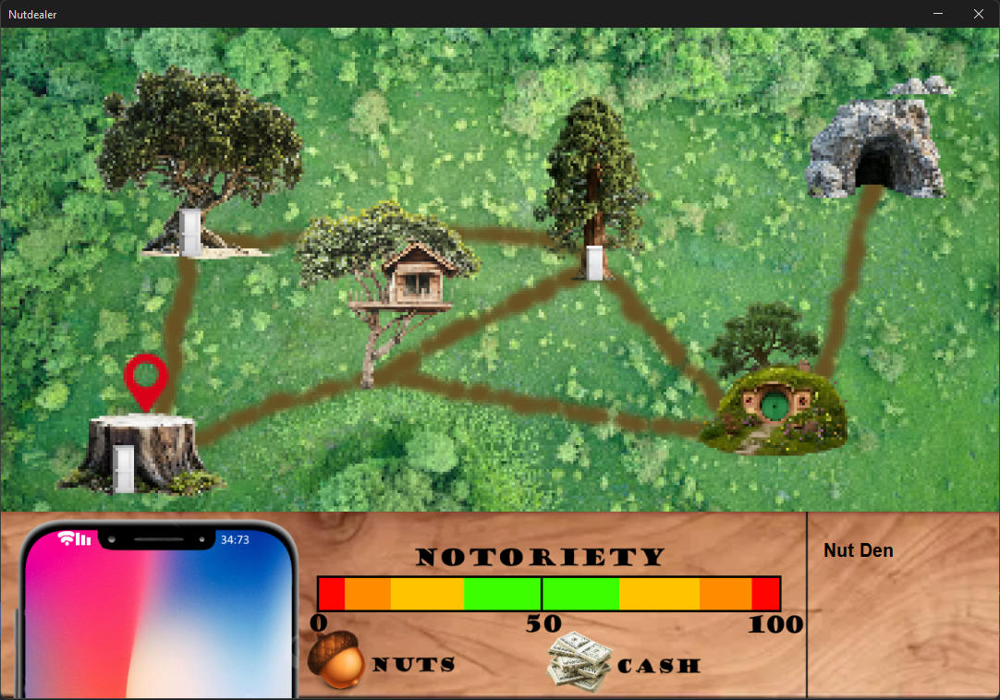

# Development Log

The development log captures key moments in your application development:

- **Design ideas / notes** for features, UI, etc.
- **Key features** completed and working
- **Interesting bugs** and how you overcame them
- **Significant changes** to your design
- Etc.

---

## Date: 20/03/2026

The window now displays both the User Interface, and the game graphics, allowing the user to interact with the game and see information needed to play.

---

## Date: 25/03/2026

Added locations class and created each location with coordinates for a bounding box, so that when a user clicks, it can find the locations and also use the position of locations for other displays and interactions. 

---

## Date: xx/xx/20xx

Example description and notes. Example description and notes. Example description and notes. Example description and notes. Example description and notes. Example description and notes.

---

## Date: xx/xx/20xx

Example description and notes. Example description and notes. Example description and notes. Example description and notes. Example description and notes. Example description and notes.

---

## Date: xx/xx/20xx

Example description and notes. Example description and notes. Example description and notes. Example description and notes. Example description and notes. Example description and notes.

---

