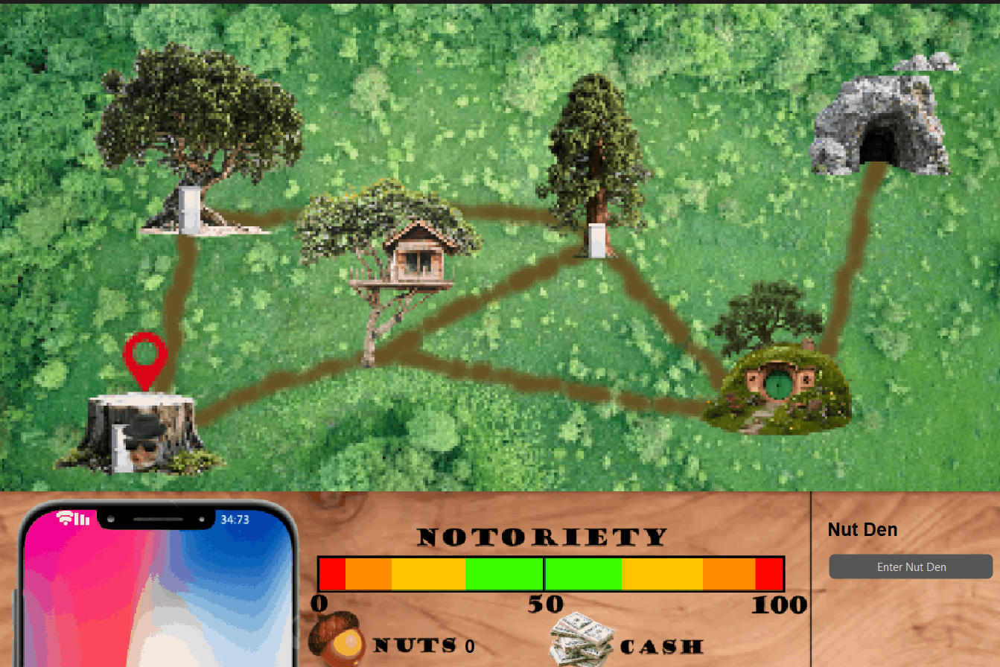
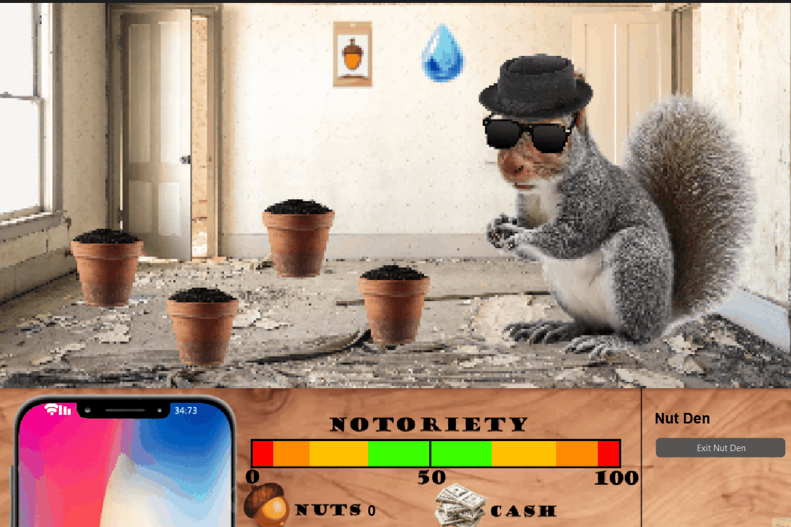
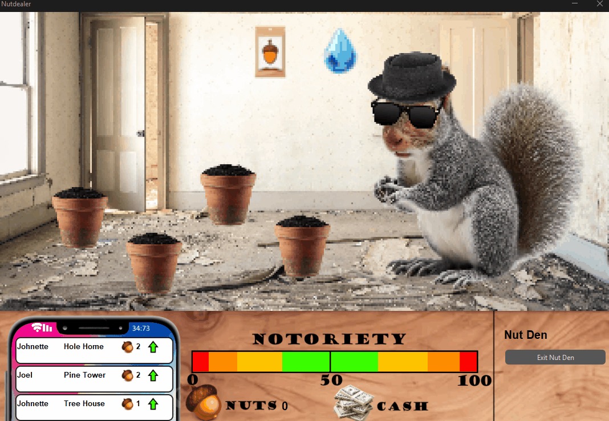

# Development Log

The development log captures key moments in your application development:

- **Design ideas / notes** for features, UI, etc.
- **Key features** completed and working
- **Interesting bugs** and how you overcame them
- **Significant changes** to your design
- Etc.

---

## Date: 20/03/2026

The window now displays both the User Interface, and the game graphics, allowing the user to interact with the game and see information needed to play.

---

## Date: 25/03/2026

Added locations class and created each location with coordinates for a bounding box, so that when a user clicks, it can find the locations and also use the position of locations for other displays and interactions.

---

## Date: 27/03/2026

Locations now can be travelling to, with a timer and animation to show the Nut Dealers position on the map. As well as this only adjacent locations can be travelled to (Along paths) and locations can be entered, with different graphics for each which are hhandled by the locations class.

---

## Date: 30/03/2026

Prototyped the nut growing system, where you would click on the pot and then a seed would be planted and grow into an acorn plant over time where it could be collected and replanted.

---

## Date: 1/04/2026

Reprogrammed the growing mechanic from scratch, implementing a drag and drop system that make the whole mechanic more interactable. Players now drag seeds into the pot, and then water it before it will grow and can be harvested, each stage of growing has a different graphic that is held in a list.

---

## Date: 12/04/2026

Added orders class, which is created and handled in the location class which means locations can create an order for themselves, making the customer only appear at the location that it is owned by.

After getting orders to create at locations and all the basic logic set up, I made the notification system to show players the information on the orders, this was the first setup, creating a notficaton widget and only displaying the name. 

Notifications displaying correctly, and showing notifications

---

## Date: 19/04/2026

Orders are now fully functional with creation, nut growing, and handing them over to customers

---

