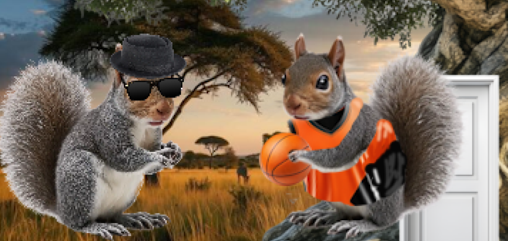
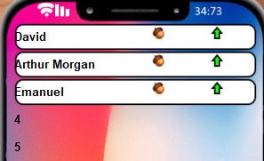
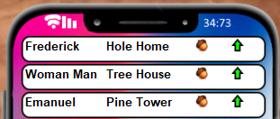

# Development Log

The development log captures key moments in your application development:

- **Design ideas / notes** for features, UI, etc.
- **Key features** completed and working
- **Interesting bugs** and how you overcame them
- **Significant changes** to your design
- Etc.

---

## Date: 20/03/2026

The window now displays both the User Interface, and the game graphics, allowing the user to interact with the game and see information needed to play.

---

## Date: 25/03/2026

Added locations class and created each location with coordinates for a bounding box, so that when a user clicks, it can find the locations and also use the position of locations for other displays and interactions. 

---

## Date: 27/03/2026

added animated travelling to locations, adjacent pathing and graphics for each location

---

## Date: 31/03/2026

prototype nut pots and growing/collecting

---

## Date: 12/04/2026

Added orders class, which is created and handled in the location class which means locations can create an order for themselves, making the customer only appear at the location that it is owned by.

After getting orders to create at locations and all the basic logic set up, I made the notification system to show players the information on the orders, this was the first setup, creating a notficaton widget and only displaying the name. 

Notifications displaying correctly, and showing notifications

---

