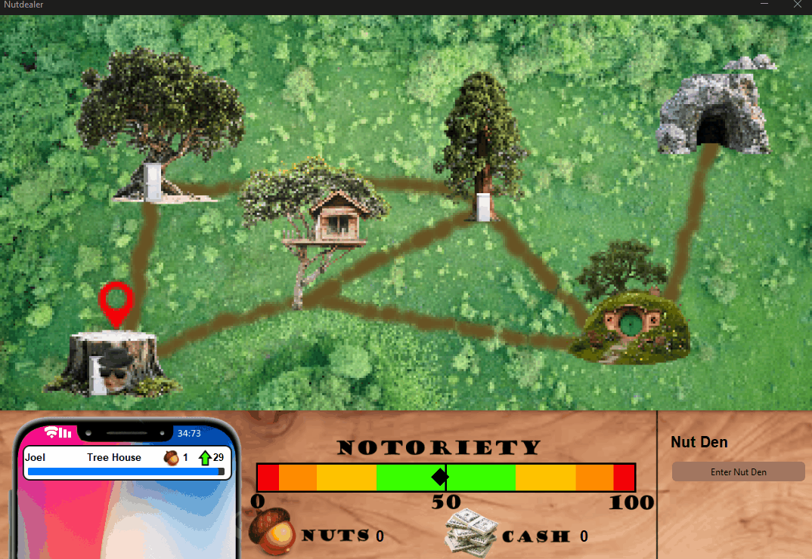
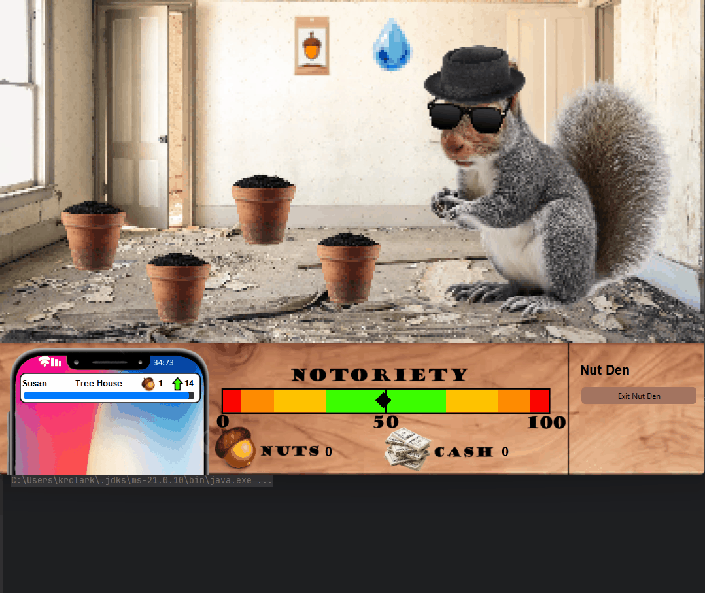
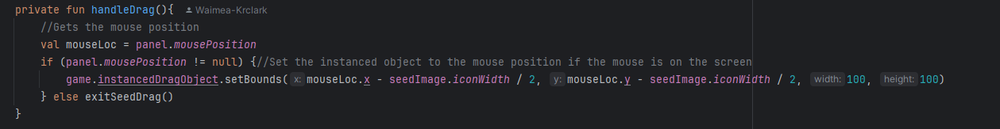
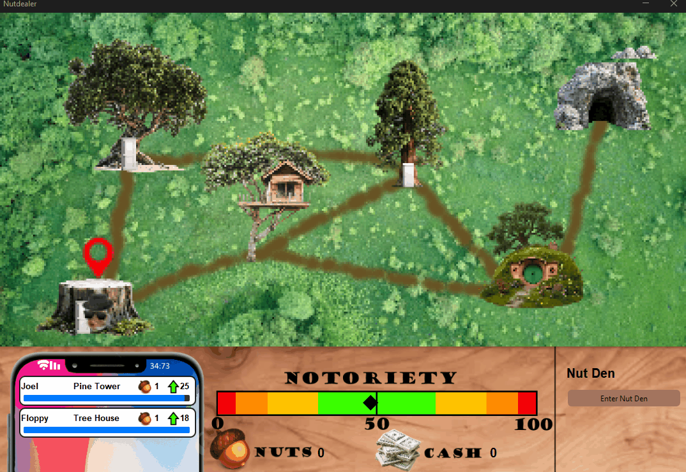
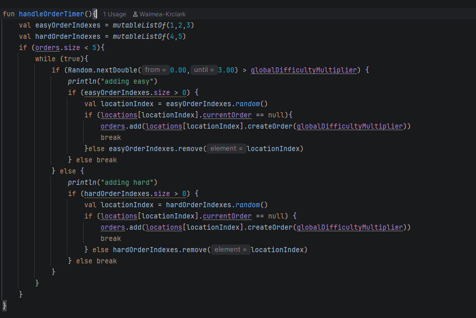
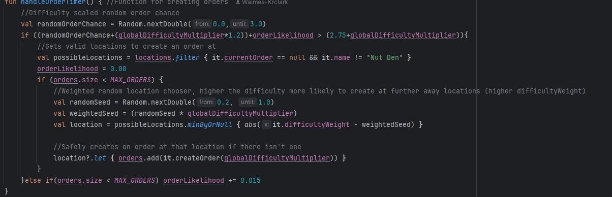
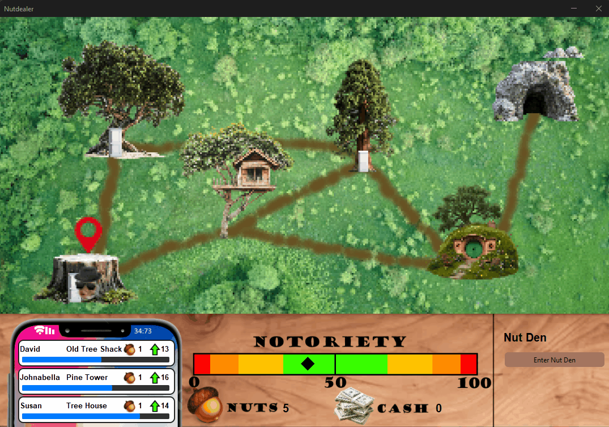

# Results of Testing

The test results show the actual outcome of the testing, following the [Test Plan](test-plan.md)

---

## Testing Bounding Boxes on Locations (Boundary)

I am going to test the world map location selecting, which is done by checking if the mouse is in the location's defined boundary and selecting the clicked on location.

### Test Data To Use

The mouse location on click and the bounds of each location. I will try clicking in a lot of different parts of the map to see the accuracy and consistency.

### Test Result

The bounds of the location are working as expected, every location is consistently selected when clicked, and clicking outside of the bounds of a location will not incorrectly select another location or throw an error, instead keeping the current location selected and doing nothing.

---

## Testing Travelling to locations (Gameplay, UI, Valid, Invalid, Boundary)

I am going to test the travelling mechanics, which creates an animated interpolation between the current location and the selected one with the user controlling this with buttons.

### Test Data To Use

Testing player input with the travelling mechanic starting and during the animation, as well as the animation itself and handling the bounds of the x and y pixel coordinates.

### Test Result

The systems for travelling work, as well as the animation of the player interpolating to the new location, trying to interact with a new location while travelling will not work, and the player will have to wait until the dealer has reached the new location before commiting another action, both to avoid errors, and reinforce time management in the gameplay.

---

## Testing nut growing functionality (Gameplay, UI, Boundary, Invalid)

Testing the full mechanics for growing the nuts. The instanced drag and drop functions and the issues with screen boundaries and invalid objects with that, as well as the actual pots and the growth stages and harvesting.

### Test Data To Use

Using the systems to grow nuts, trying multiple different interactions to test how the system handles the drag and drop, as well as the mouse interactions.

### Test Result

The main part of the Nut growing system works well, it handles expected user inputs as well as unexpected inputs from the player, however if the seed pack or water drop if drag out of bounds of the window, the game will throw an index out of bounds error.

With a simple check to see if the mouse position is valid before attempting to update the position of the drag object, and removing it if not valid, it safely handles the boundary and invalid reference and stops it from throwing errors.

Nut growing fixed and working properly

---

## Testing order creation (UI, Gameplay, Invalid)

Testing the order creation, which is a weighted random chance on a timer, that creates an order at a random valid location. This then is added to the players screen along with a timer.

### Test Data To Use

I will let the game create a lot of orders, as well as completing some to test the order creation at different stages of the game, to see how well it makes orders and handles invalids like the nullable current order at locations and the amount of locations avaliable.

### Test Result

The old system orders was very slow, inconsistent and handled any changes in data poorly. The performance of the order creation was terrible, usually freezing the game briefly when trying to create and order and sometimes failing to do so entirely. As this system was terrible I scrapped it entirely and completely rewrote it.

This new system doesn't impact the performance of the game due to it not having to check through each location to create an order. It handles invalid data like there not being any possible locations, or the nullable current order in the location classes by safely checking and getting variables, and using a safe .let{} call to actually create the order so it will only create an order if the location in valid, and the current order is null.

Now orders are being added correctly, the frequency is scaling correctly with the difficulty. Order will be removed at the end of their timer properly, and will also be removed if the player completes the order. Orders also will not be attempted to be created if the orders are at capacity (MAX_ORDERS = 3)

---

## Testing notoriety bar (Boundary)

I will be testing the notoriety bar, which is a custom-made progressbar where the marker interpolates between the two bounds (Min and Max values of the bar)

### Test Data To Use

Running the game, and completing/failing orders to see how the bar handles changes in notoriety, as well as how it handles reaching either boundary.

### Test Result

The Notoriety bar is in the correct position for the players notoriety, and always updates to the next correct position. Completing and failing orders also changes the notoriety which updates the bar properly. The marker never leaves the bounds of the bar.

---

## Testing endgame mechanics (Gameplay, UI)

I will be testing both end game states of the game, with the notoriety bar reaching either 0, or 100 which should trigger the game to end, and the player be taken to the end screen.

### Test Data To Use

To test it, achieving both endings of the game to see how well it handles shutting down the game, taking the player to the end screen and handling the audio.

### Test Result

---

## Testing user inputs during the game (Invalid, Valid)

I will be testing user inputs during gameplay, how it handles and reacts to certain inputs at certain times, and how it deals with invalid inputs from the player.

### Test Data To Use

Testing all inputs from the player, keyboard input, mouse clicks, mouse position and buttons in the GUI.

### Test Result

---

